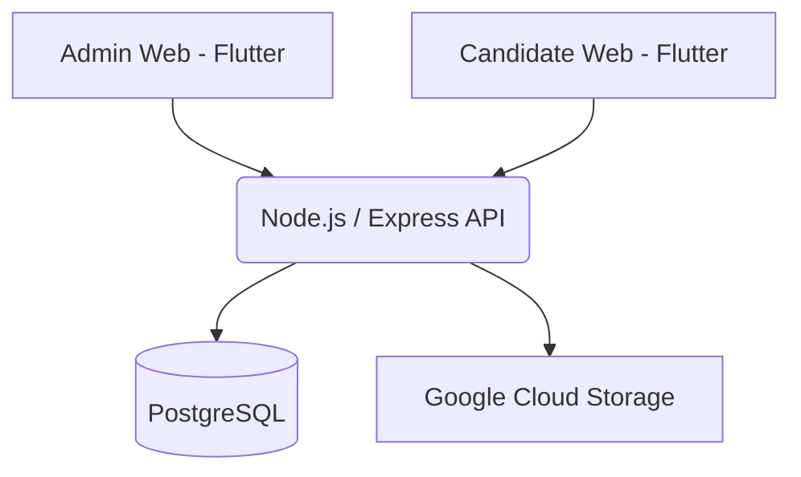

# TalentOS Recruitment

TalentOS Recruitment is a lightweight, self-hosted applicant tracking system (ATS) designed for individuals or small teams to seamlessly manage positions and candidates.

## 🚀 Features
- **Admin Web**: A clean Flutter dashboard to track candidates, export to Excel, and manage positions.
- **Candidate Web**: A public-facing portal for applicants to view jobs and submit resumes natively.
- **Node.js + Express**: A simple, robust backend.
- **PostgreSQL**: Reliable relational data storage.
- **Google Cloud Storage**: Securely stores candidate resumes and documents.

## 🏗️ Architecture



## 🛠️ Local Startup Guide

### Prerequisites
- Docker and Docker Compose
- Node.js 20+
- Flutter SDK (stable)

### 1. Environment Setup
1. Copy `.env.example` to `.env` in the project root.
2. Provide a valid `JWT_SECRET`.
3. Drop your GCP Service Account JSON key in the root directory named `gcs-key.json` and configure `GCS_BUCKET_NAME`.

### 2. Running Locally (Docker Compose)
The easiest way to start TalentOS is via Docker:
```bash
docker-compose up -d --build
```
This command orchestrates the API, PostgreSQL database, and NGINX reverse proxy for both Flutter frontends.

### 3. Accessing the Apps
- **Admin Web**: `http://admin.talentos.local` (ensure your `/etc/hosts` maps this to `127.0.0.1`)
- **Candidate Web**: `http://careers.talentos.local`
- **Backend API**: `http://localhost:3000`

### 4. Initial Database Migration
Once the containers are running, push the database schema:
```bash
docker-compose exec api npx prisma db push
```

You're now ready to recruit!
