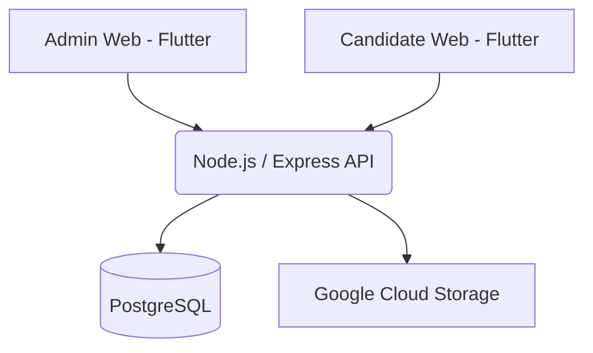

# TalentDock Recruitment

TalentDock Recruitment is a lightweight, self-hosted applicant tracking system (ATS) designed for individuals or small teams to seamlessly manage positions and candidates.

## 🚀 Features
- **Admin Web**: A clean Flutter dashboard to track candidates, export to Excel, and manage positions.
- **Candidate Web**: A public-facing portal for applicants to view jobs and submit resumes natively.
- **Node.js + Express**: A simple, robust backend.
- **PostgreSQL**: Reliable relational data storage.
- **Google Cloud Storage**: Securely stores candidate resumes and documents.

## 🏗️ Architecture



## 🛠️ Quick Start Guide

Follow these steps to get your personal recruitment system running from a fresh clone.

### Prerequisites
- Docker & Docker Compose installed
- Node.js 20+ installed
- Flutter SDK (stable) installed

### 1. Install Dependencies
```bash
cd services/api && npm install
cd ../../apps/admin_flutter && flutter pub get
cd ../candidate_flutter && flutter pub get
cd ../..
```

### 2. Environment Configuration
Copy the template environment file:
```bash
cp .env.example .env
```
*(Optionally, place your GCP Service Account JSON key as `gcs-key.json` in the root and configure `GCS_BUCKET_NAME` inside `.env` if you want working file uploads).*

### 3. Start the Backend & Database
Use Docker Compose to spin up the PostgreSQL database and API:
```bash
docker-compose up -d --build
```

### 4. Database Setup & Seeding
From the root directory, execute the database migration and run the seed script to create your Admin account and a sample position:
```bash
docker-compose exec api npx prisma db push
docker-compose exec api npx prisma db seed
```

### 5. Start the Web Apps
Open two new terminal windows and start the Flutter web clients:

**Terminal 1 (Admin Web):**
```bash
cd apps/admin_flutter
flutter run -d web-server --web-port 8080
```

**Terminal 2 (Candidate Web):**
```bash
cd apps/candidate_flutter
flutter run -d web-server --web-port 8081
```

*(Note: If using NGINX via Docker Compose, you can map `admin.talentdock.local` and `careers.talentdock.local` in your hosts file to access them seamlessly without running standalone web-servers).*

### 6. You're Ready!
Log in at `http://localhost:8080` using:
- **Email:** `admin@talentdock.local`
- **Password:** Checked your `.env` for `ADMIN_PASSWORD`, or use the temporary default `talentdock-temp` (you will be prompted to change it).
